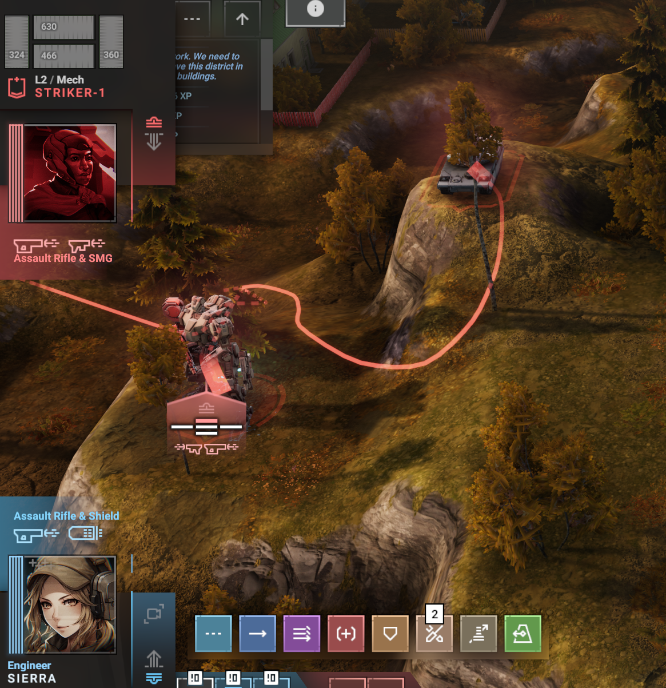

## Overview

In combat, enemy pilots will be given a randomly selected 'portrait' image.

This mod does not itself provide any pilot portraits. This mod is intended to be used alongside one or more mods that add pilot portraits (referred to as an 'overlay' when using the game's built-in pilot customization mechanism).

## Questions & Answers

### How do I get pilot portraits?

Find an existing mod.

"Sample: 2D Portraits" (https://steamcommunity.com/sharedfiles/filedetails/?id=3270976290) is one example. That can also be used as a starting point for making your own set of pilot portraits (just drop new 256x256 RGB-without-alpha images into the right folder; you can even download that mod, then cut-and-paste it from its folder C:\Program Files (x86)\Steam\steamapps\workshop\content\553540, to your local mods folder C:\Users\YourID\AppData\Local\PhantomBrigade\Mods\your-new-mod).

Note that comms-chatter images are separate but can also be modded. See Phantom Brigade\PhantomBrigade_Data\StreamingAssets\UI\CombatComms (e.g., put replacements in Mods\my_mod_name\Textures\UI\CombatComms\*.png).

### What about save games?

Should work with existing saves, and shouldn't break anything.

(Bonus note: Phantom Brigade seems robust against deleting portraits from your portrait mod; it will revert to no-overlay/portrait for affected pilots.)

## Future Work

There are various improvements that could be made (including some that are seem relatively simple). Some possible improvements are noted in the source-code file for this mod.
